# Laboratório 01 - Instalação das ferramentas de desenvolvimento - Ubuntu 20.04

## 1 - Objetivos

Configurar o Ubuntu 20.04 no Windows Subsystem for Linux 2 (WSL2) como sistema
para desenvolvimento de firmware para microcontroladores da família STM32.
Nesta aula iremos instalar

* GCC - GNU C Compiler;
* GCC ARM Toolchain;
* OpenOCD - Open On Chip Debugger;
* Sistema de controle de versões Git, e;
* Microsoft Visual Studio Code.

## 2 - Pré-requisitos

* Ubuntu 20.04;
* Conhecimento básico da utilização de sistemas Linux;
* ST-LINK *in-circuit debugger and programmer*.

## 3 - Referências

[5] [GCC online documentation](https://gcc.gnu.org/onlinedocs/)

[6] [GCC ARM Toolchain](https://developer.arm.com/tools-and-software/open-source-software/developer-tools/gnu-toolchain/gnu-rm/downloads)

[7] [Git](https://git-scm.com/)

## 4 - Instalação do compilador e da ferramenta de controle de versões

Agora, iremos instalar algumas ferramentas básicas que utilizaremos ao longo do
nosso curso, o compilador *GCC - GNU C Compiler* e ferramenta de controle de
versões *Git*. Para instalar estas ferramentas digite o comando abaixo:

```console
foo@bar$ sudo apt install build-essential git
```

Após finalizar o processo de instalação verifique se o **gcc** e o **git**
foram instalados corretamente

```console
foo@bar$ gcc --version
```

```console
foo@bar$ git --version
```

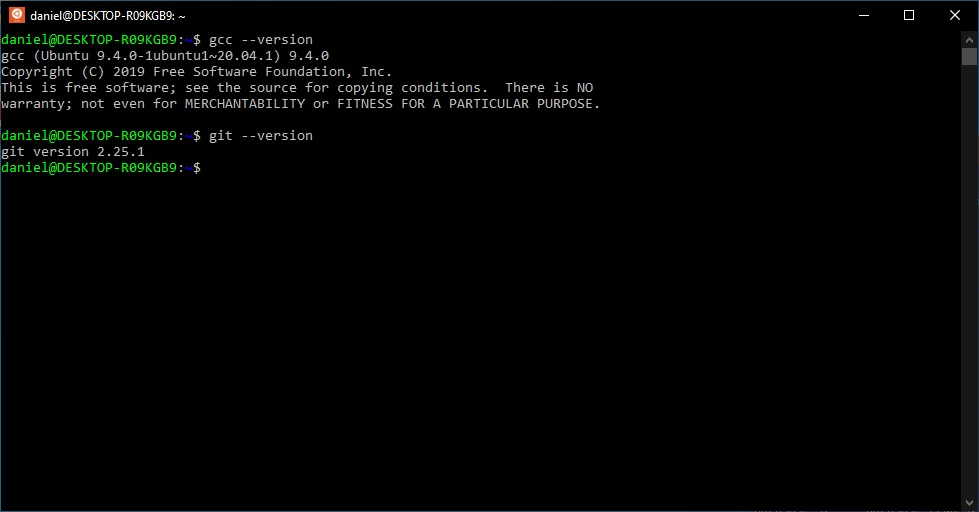

Para poder utilizar o **git** é necessário informar um nome de usuário e um
e-mail:

```console
foo@bar$ git config --global user.name "seu nome aqui"
foo@bar$ git config --global user.email "seu e-mail aqui"
```

Os arquivos necessários para realização das atividades de laboratório serão
dsponibilizados por meio de repositórios **git**. Um repositório, ou repo, é 
um diretório onde os arquivos do seu projeto ficam armazenados. Ele pode ficar
hospedado na nuvem, no GitHub ou no Bitbucket por exemplo, ou em uma pasta no
seu computador. No repositório você pode armazenar códigos, imagens, áudios,
ou qualquer outro arquivo relacionado ao projeto.

Para baixar ou copiar os arquivos de um repositório **git** utilizaremos o
comando **git clone**. O principal objetivo deste comando é obter uma cópia
exata de todos os arquivos de um repositório remoto para um repositório
local. Por padrão, todo o histórico deste repositório é copiado também. Assim,
para baixar os arquivos necessário para o **Laboratório-01** execute os
seguintes comandos:

```console
foo@bar$ cd semb1-workspace
foo@bar$ git clone https://github.com/daniel-p-carvalho/ufu-semb1-lab-01.git lab-01
```

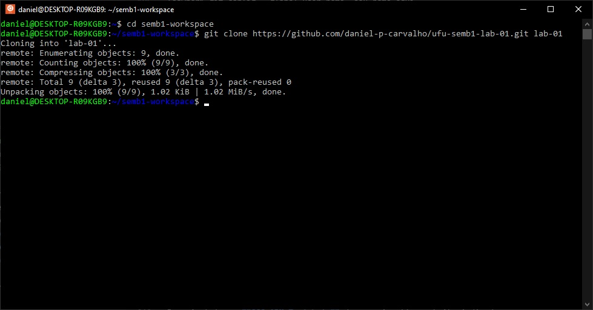

O comando acima *clonou* o conteúdo do repositório remoto
[ufu-semb1-lab-01.git](https://github.com/daniel-p-carvalho/ufu-semb1-lab-01.git)
no diretório **lab-01**. Você pode utilizar o comando **ls** para se certificar
que o diretório foi criado corretamente.

```console
foo@bar$ ls -l
```

Maiores informações sobre o comando **ls** digite:

```console
foo@bar$ man ls
```

## 5 - GCC ARM Toolchain

Para instalar o **GCC ARM Toolchain** devemos ir até o website indicado na
referência [6] e baixar o arquivo com uma versão pré-compilada do *toolchain*
para Linux. Na ocasião da escrita deste texto a última versão disponível era
de outubro de 2021. Copie o endereço do link
[gcc-arm-none-eabi-10.3-2021.10-x86_64-linux.tar.bz2](https://developer.arm.com/-/media/Files/downloads/gnu-rm/10.3-2021.10/gcc-arm-none-eabi-10.3-2021.10-x86_64-linux.tar.bz2).

Em seguida navegue até o diretório Downloads e baixe o **toolchain**

```console
foo@bar$ cd
foo@bar$ cd Downloads
foo@bar$ wget \
https://developer.arm.com/-/media/Files/downloads/gnu-rm/10.3-2021.10/gcc-arm-none-eabi-10.3-2021.10-x86_64-linux.tar.bz2
```

Após o término do download descompacte o arquivo no diretório ***/usr/share***.

```console
foo@bar$ sudo tar xjf gcc-arm-none-eabi-10.3-2021.10-x86_64-linux.tar.bz2 -C /usr/share/
```

Para facilitar a utilização vamos criar links simbólicos dos programas fornecidos pelo
**toolchain** no diretório ***/usr/bin/***

```console
foo@bar$ sudo ln -s /usr/share/gcc-arm-none-eabi-10.3-2021.10/bin/* \
> /usr/bin/
```

Por fim, precisamos instalar as dependências necessárias para a utilização do **toolchain**

```console
foo@bar$ sudo apt install libncurses-dev libtinfo-dev
foo@bar$ sudo ln -s /usr/lib/x86_64-linux-gnu/libncurses.so.6 \
> /usr/lib/x86_64-linux-gnu/libncurses.so.5
foo@bar$ sudo ln -s /usr/lib/x86_64-linux-gnu/libtinfo.so.6 \
> /usr/lib/x86_64-linux-gnu/libtinfo.so.5
```

Podemos testar se o *toolchain* foi instalada correntamente por meio dos comandos:

```console
foo@bar$ arm-none-eabi-gcc --version
foo@bar$ arm-none-eabi-g++ --version
foo@bar$ arm-none-eabi-gdb --version
```

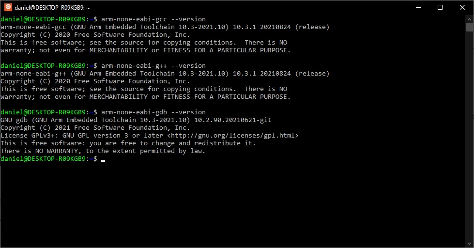

## 6 - Instalação das ferramentas de gravação e depuração de código

### 6.1 - Instalação do OpenOCD

Para instalar o OpenOCD podemos utilizar o gerenciador de pacotes do Ubuntu,
**apt**. Entretanto, a versão do OpenOCD que é instalada utilizando o **apt** é
antiga, versão 0.10.0-6. Iremos utilizar a versão 0.11.0 que possui um suporte
melhorado aos dispostivos STM32 e ao gravador ST-LINK. Logo, vamos compilar o
OpenOCD a partir do código fonte.

Para entender e executar o processo de compilação é muito importante que você leia 
atentamente as instruções contidas no arquivo README. De maneira geral podemos
compilar o OpenOCD executando os passos abaixo.

A primeira coisa que iremos fazer é remover qualquer instalação exstente do OpenOCD

```console
foo@bar$ sudo apt remove openocd
```

Para compilar o OpenOCD é necessário alguns pacotes adicionais são eles:

* make (instalado);
* libtool;
* pkg-config >= 0.23 (ou compatível).

Para compilar a partir de um repositório GIT também precisamos dos pacotes:

* autoconf >= 2.69;
* automake >= 1.14;
* texinfo >= 5.0.

Gravadores que utilizam a intergace USB também dependem da

* libusb-1.0.

Estes pacotes podem ser instalados através do comando

```console
foo@bar$ sudo apt install libtool pkg-config autoconf automake texinfo libusb-1.0-0-dev
```

Em seguida, clone o código fonte do OpenOCD utilizando a ferramenta de controle de
versões **git**

```console
foo@bar$ cd
foo@bar$ cd Downloads
foo@bar$ git clone https://git.code.sf.net/p/openocd/code openocd-code
```

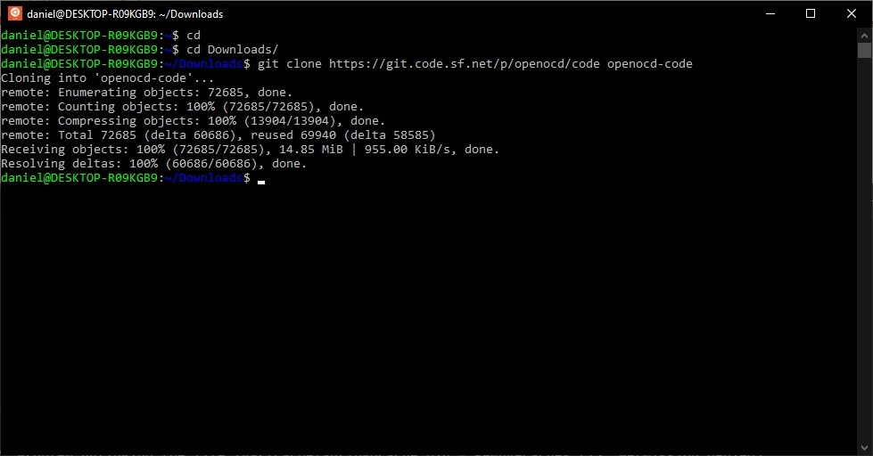

```console
foo@bar$ cd openocd-code
foo@bar$ git tag
```

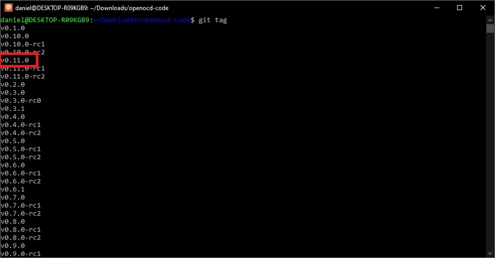

Desejamos utilizar a versão *v0.11.0* portanto, devemos trocar para este *tag*.

```console
foo@bar$ git switch -c v0.11.0
```

Agora, podemos compilar o **OpenOCD** utilizando a seguinte sequência de comandos

```console
foo@bar$ ./bootstrap
```

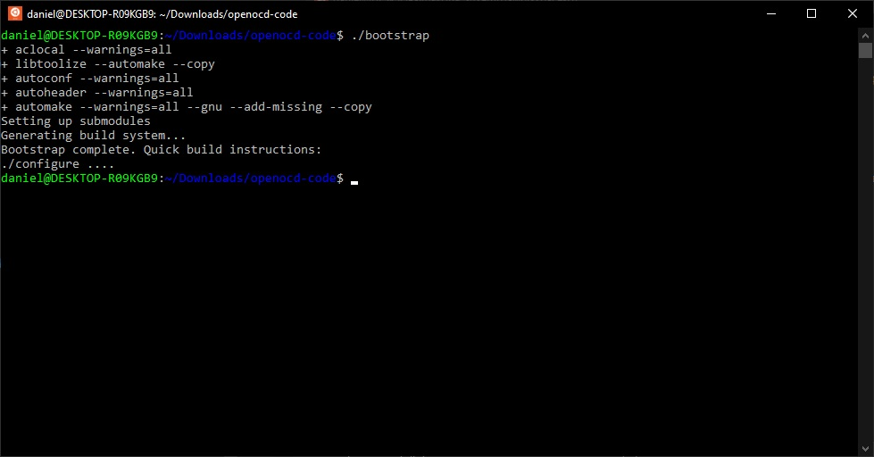

```console
foo@bar$ ./configure --enable-stlink
```


```console
foo@bar$ make
foo@bar$ sudo make install
```

Para verificar se o **OpenOCD** foi instalado corretamente utilizamos o comando

```console
foo@bar$ openocd --version
```

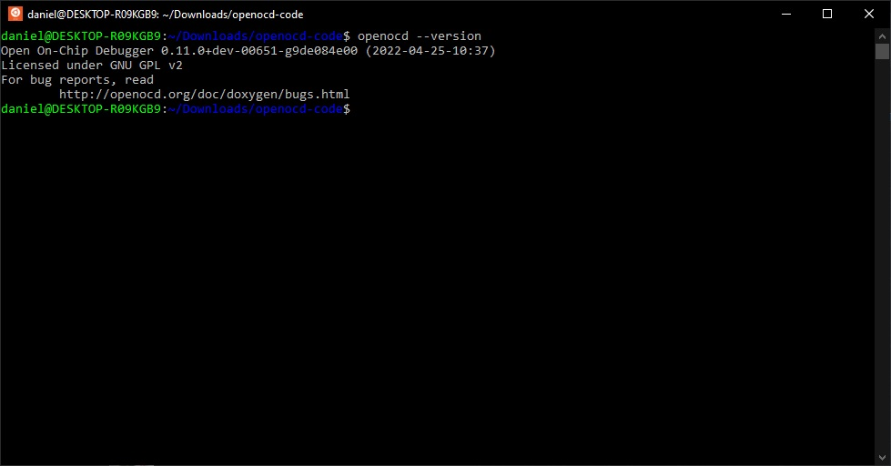

### 6.2 - Ferramentas de código aberto ST-LINK

As ferramentas de código aberto ST-LINK também podem ser utilizadas para
gravar e depurar programas desenvolvidos para dispositivos *STM32*. Iremos
utilizar as seguintes aplicações:

* **st-info** - a programmer and chip information tool
* **st-flash** - a flash manipulation tool
* **st-util** - a GDB server (supported in Visual Studio Code / VSCodium via the Cortex-Debug plugin)

As ferramentas **stlink** podem ser instaladas utilizando o utilitário **apt**.

```console
foo@bar$ sudo apt install stlink-tools
```

A versão disponibilizada pelo **apt** é antiga logo, iremos optar por compilar
a versão estável mais recente disponibilizada no repositório oficial 
[stlink-org](https://github.com/stlink-org/stlink). Informações detalhadas de
como compilar as ferramentas podem ser obtidas na documentação disponiblizada no
repositório. 

Antes de compilar e instalar as ferramentas **stlink** do repositório oficial
certifique-se de remover a versão instalada utilizando o gerenciado de pacotes

```console
foo@bar$ sudo apt remove stlink-tools
```

Navegue até o diretório *Downloads* e clone o repositório

```console
foo@bar$ cd
foo@bar$ cd Downloads
foo@bar$ git clone https://github.com/stlink-org/stlink stlink-tools
```


Para compilar as ferramentas **stlink** é necessário instalar os pacotes a
seguir:

* git;
* gcc (provavelmente instalado);
* build-essential (distribuições baseadas no Debian como o Ubuntu);
* cmake;
* libusb-1.0;
* libusb-1.0-0-dev (arquivos de cabeçalho utilizados na compilação);
* libgtk-3-dev (opcional, utilizada para a aplicação stlink-gui);
* pandoc (opcional, needed for generating manpages from markdown)

Iremos instalar apenas os pacotes necessários

```console
foo@bar$ sudo apt install git build-essential cmake libusb-1.0-0 libusb-1.0-0-dev
```

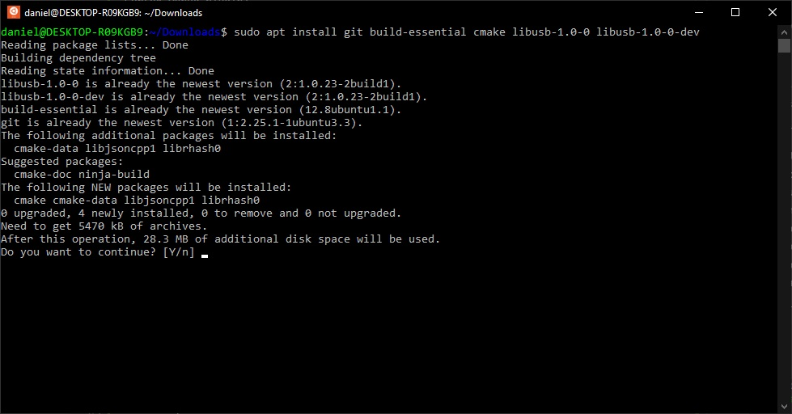

Navegue até o diretório do código fonte e liste as versões estáveis disponíveis:

```console
foo@bar$ cd stlink-tools
foo@bar$ git tag
```

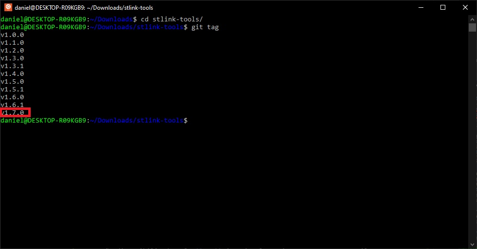

Desejamos compilar a versão estável mais recente logo, necessitamos alterar
o *branch* para a *tag* da versão desejada:

```console
foo@bar$ git switch -c v1.7.0
```

Para compilar e instalar as ferramentas **stlink** execute os seguintes comandos

```console
foo@bar$ make clean
foo@bar$ make release
foo@bar$ sudo make install
```

Pode ser necessário atualizar as bibliotecas de vínculo dinâmico do sistema. Para isso execute o comando **ldconfig**

```console
foo@bar$ sudo ldconfig
```

Verifique se as ferramentas **stlink** foram instaladas corretamente

```console
foo@bar$ st-flash --version
foo@bar$ st-info --version
foo@bar$ st-trace --version
foo@bar$ st-util --version
```

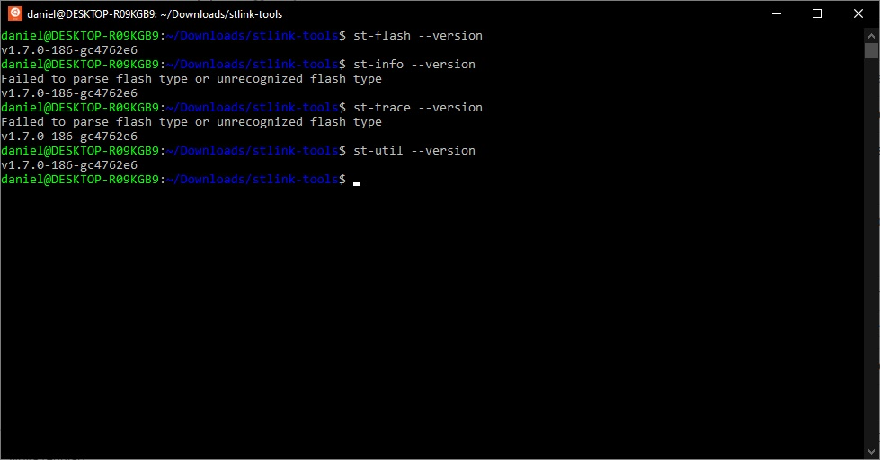

## 7 - Instalação do IDE Visual Studio Code

O **Visual Studio Code** (VS Code) é um Ambiente de Desenvolvimento Integrado
(*Integrated Development Environment - IDE*) de código aberto desenvolvido
pela Microsoft disponível para Windows, Mac e Linux.

O **VS Code** a princípio é uma ferramenta simples e leve e tem como 
funcionalidades básicas:

* edição de código com suporte a várias linguagens de programação;
* terminal de comandos integrado;
* controle de versão;

Estas funcionalidades podem ser facilmentes estendidas utilizando a loja de
extensões.

Vamos utilizar a versão para **Windows** do **VS Code** que pode ser facilmente
integrado ao **WSL** utilizando extensções. Para instalar o **VS Code** faça o
*download* do arquivo do instalador em https://code.visualstudio.com/download
e siga as instruções para a instalação. Ao término do processo de instalação
abra o **VS Code**. Caso deseje instale o pacote de idiomas
**Portuguese Brazil**.


Agora vamos utilizar as extensões para customizar o **VS Code** para acessar o
**WSL** e adicionar ferramentas para edição e depuração de códigos em linguagem
C.

Abra a loja de extensões do **VS Code** clicando no ícone *Extensions* ou 
utilizando as teclas de atalho **CTRL + SHIFT + X** pesquise pela extensão 
**Remote - WSL** e realize a instalação. Pode ser necessário reiniciar o
**VS Code**.


Para instalar as ferramentas de suporte à edição de código em Linguagem C
pesquise na loja de extensões por **C/C++** e instale as seguintes extensões

* C/C++;
* C/C++ Extension Pack; e,
* C/C++ Themes.

Observe na seção *Overview and tutorials* que existem diversos *links* para
exemplos e tutoriais de como utilizar a extensão.


Instale também a ferramenta para depuração de dispositivos *ARM Cortex-M*.
Pesquise na loja de extensões por **Cortex-Debug** e instale a extensão

* **Cortex-Debug**

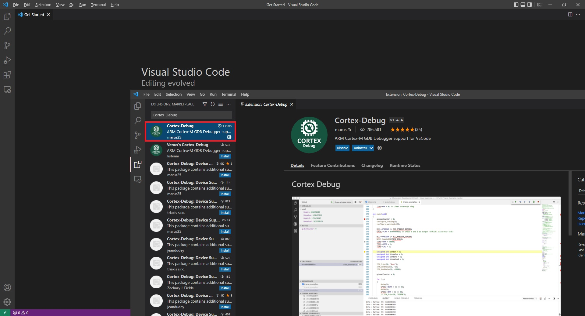

Para utilizar o **VS Code** em conjunto com o **WSL** clique no ícone verde, no
canto inferior esquerdo, e abra uma nova janela remota do **VS Code**.


Na nova janela do **VS Code** abra loja de extensões e instale no **WSL** as
extensões instalaladas localmente. Selecione

* C/C++;
* C/C++ Extension Pack;
* C/C++ Themes; e,
* **Cortex-Debug**.

